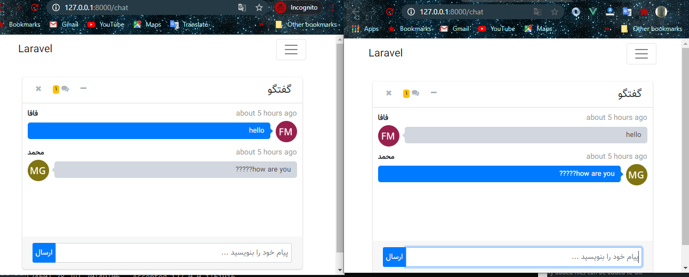

## About chat application

this chat is real time with laravel and vuejs and laravel echo and redis.

#### how run this project:

1. first install redis server and run.
this [tutorial](https://www.onlinetutorialspoint.com/spring-boot/setup-install-redis-server-on-windows-10.html) for install and run in window.
2. then composer install and npm install.
3. copy .env.example php artisan key:generate for create key.
4. make database then set to .env file DB_DATABASE=chat.
5. php artisan migrate.
6. set BROADCAST_DRIVER=redis in .env file.
7. then php artisan serve and laravel-echo-server start.
8. open two browser and authenticate by user then enjoy from chat...

### screenshot from chat:

